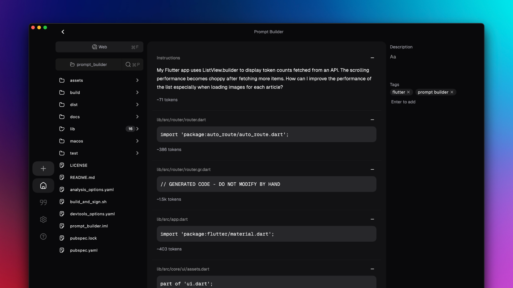

# Prompt Builder


[](https://twitter.com/sangddn)

[Website](https://promptbuilder.site). [Download for macOS](https://github.com/sangddn/prompt_builder/releases/download/v0.0.6/prompt-builder-macos-universal-v0.0.6.zip).



## What is Prompt Builder?

Prompt Builder is a macOS app for creating **long, complex prompts** for LLMs. Whether you're coding, journaling, or writing a novel, Prompt Builder helps you **pull together multiple files, transcripts, images, and snippets** all in one prompt—without the headache of manually copying and pasting content or worrying about token counts.

**Features**:
- **Local Files**: Add local files to your prompt with just a click; see estimated token usage.
- **URLs & YouTube**: Fetch web content or YouTube transcripts automatically, then optionally summarize and inject them.
- **Summaries**: Summarize long-form texts before injecting to keep your prompts succinct.
- **Audio/Video Transcription**: Quickly transcribe `.mp3`, `.mp4`, `.wav`, etc. (via OpenAI Whisper or Gemini).
- **Image Descriptions**: Generate captions/descriptions for images to include in your prompts.
- **Metaprompting**: Prompt Builder can generate prompts for you with placeholders—handy for reusability and faster iteration.
- **Web Search**: Search the web for content and add it to your prompt. Supports [Exa](https://exa.ai) and [Brave](https://api.search.brave.com).
- **Snippets**: Save frequently used text blocks or instructions as “snippets” and quickly insert them.
- **Community Snippets**: Explore other users’ snippet libraries (planned feature) to supercharge your own prompt-building.
- **Local-First & Open Source**: 100% local data ownership. Bring your own API keys for OpenAI, Anthropic, Google, etc.
- **Automatic Delimiters**: Prompt Builder automatically formats text in XML blocks or triple-backtick code blocks.

## Why Use Prompt Builder?
If your workflows involve **lots of reference material**—like dozens (or hundreds) of local files, docs, transcripts, PDFs, images, or even random YouTube tutorials—Prompt Builder helps you quickly compile them into a single prompt. This is especially useful for:

- **Coding**: Inject your own or library source files into an LLM for code refactoring or debugging.
- **Writing**: Keep a big batch of reference docs, story notes, or research. Summarize them if you need to cut the token usage.
- **Journaling / Brainstorming**: Embed your personal logs, diaries, or voice memos (transcribed) into a prompt for reflection or idea generation.
- **Any “Super Long Context”** scenario: If you have hundreds of sources, multiple mediums (audio/video), and you just want them in your prompt with minimal friction.

Prompt Builder’s biggest value prop: **Ergonomics** for building longer and better prompts. Instead of juggling different notes, articles, video transcripts, and so on, you do it all in one place—and you see your approximate token usage in real time.

## Installation & Usage

- **Platform Support**: Currently supports **macOS only**.
- **Download**: Grab the latest `.dmg` or `.zip` from the [GitHub Releases page](https://github.com/sangddn/prompt_builder/releases).  
- **Run Locally**:
  1. Install [Flutter](https://docs.flutter.dev/get-started/install) if you haven't already.
  2. Clone this repo:  
     ```bash
     git clone https://github.com/sangddn/prompt_builder.git
     cd prompt_builder
     ```
  3. Run on macOS:  
     ```bash
     flutter run -d macos --profile
     ```
  4. Alternatively, build a release via:  
     ```bash
     flutter build macos
     ```
  5. (Optional) Provide your API keys (OpenAI, Anthropic, etc.) in the app’s **Settings**.

I plan to add official builds for Windows/Linux in the future, but for now, macOS is the primary development and test environment.

## Quick Example

1. **Open a folder** to reveal your local files (PDFs, `.md`, docs, etc.) on the left panel.  
2. **Click a file** to add it to your prompt. The text is automatically extracted, token counts are shown.  
3. **Paste a YouTube link**. Prompt Builder fetches the transcript, optionally summarizes it.  
4. **Add your own text block** with placeholders like `{{USER_NAME=John}}` to fill in dynamic values each time.  
5. **Finalize** the entire prompt with a single “Assemble & Copy” button. Done.

---

## Contributing

### Overview

Thanks for wanting to contribute! This project is in a **very early** state, so don’t be surprised if code is changing frequently.

1. **Fork** the repo.  
2. **Clone** your fork, make a local branch off `main`.  
3. Implement your feature or bugfix.  
4. Submit a **Pull Request** (PR). I’ll review as soon as possible.  

Currently, **test coverage is at 0%**. PRs for even basic tests are **hugely** appreciated. I aim to drastically improve test coverage soon.

### Helpful Notes

- We use [Drift](https://drift.simonbinder.eu/) for local database.  
- Please see the `analysis_options.yaml` for linting rules.

For any questions, feel free to open an issue or ping me on Twitter [@sangddn](https://twitter.com/sangddn).

[](https://www.buymeacoffee.com/sangd)
